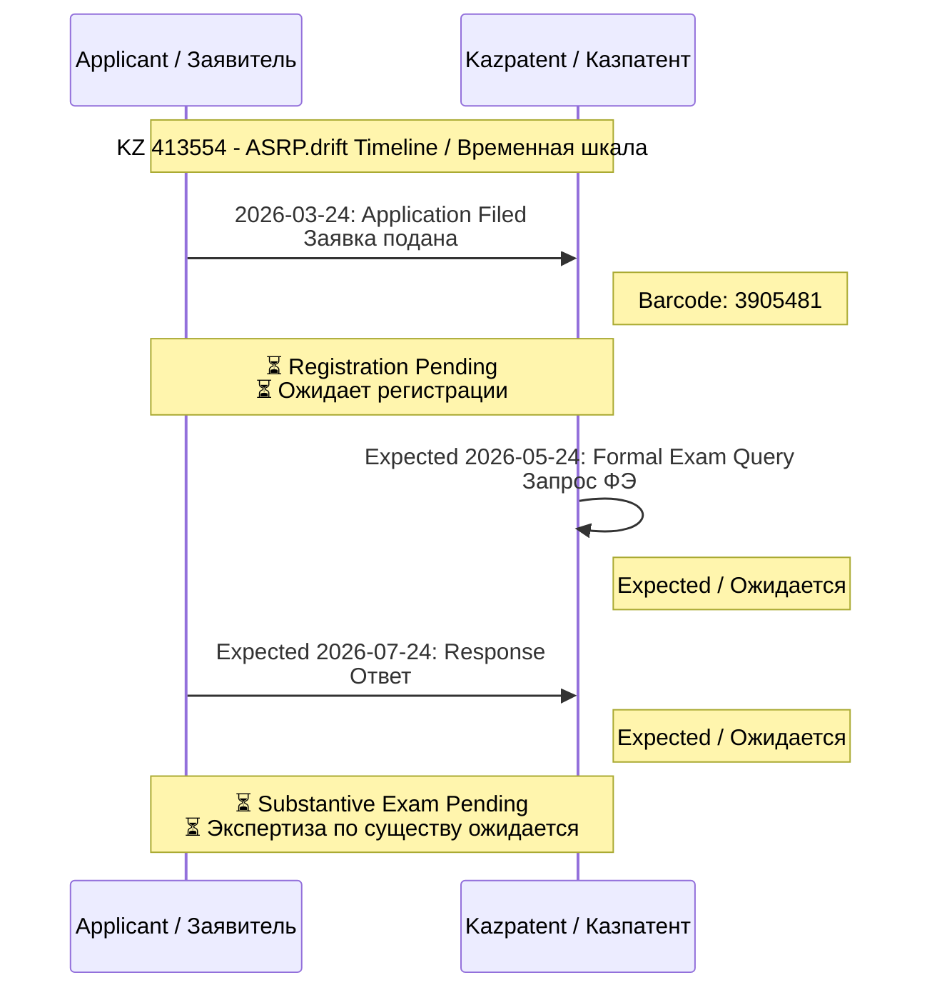

# 📋 ISSUE #1 - COMPLETE APPLICATION PACKAGE / ПОЛНЫЙ ПАКЕТ ЗАЯВКИ

**Application Number / Номер Заявки:** KZ 413554  
**Filing Date / Дата Подачи:** 24 March 2026 / 24 марта 2026  
**Status / Статус:** 🟡 Registration Pending / Ожидает регистрации

---

## 👥 APPLICANTS & INVENTORS / ЗАЯВИТЕЛИ И ИЗОБРЕТАТЕЛИ

**All inventors are equal co-authors / Все изобретатели являются равными соавторами**

| # | Name / ФИО | Country / Страна | IIN / ИИН | Email | Role / Роль | Signed / Подписано |
|---|------------|-----------------|-----------|-------|-------------|-------------------|
| 1 | **OVSEANNIKOVA VALERIA ALEXANDROVNA / ОВСЯННИКОВА ВАЛЕРИЯ АЛЕКСАНДРОВНА** | 🇲🇩 MD | 001228050911 | valeriaovseannicova@asrp.tech | Co-Inventor / Соавтор | ⏳ Pending / Ожидается |
| 2 | **BANCHENKO DENIS YURIEVICH / БАНЧЕНКО ДЕНИС ЮРЬЕВИЧ** | 🇰🇿 KZ | 800622301483 | denisbanchenko@asrp.tech | Applicant, Co-Inventor / Заявитель, Соавтор | ✅ Signed / Подписано (24.03.2026) |
| 3 | **KAPUSTIN MYKHAILO MYKHALOVICH / КАПУСТИН МИХАЙЛО МИХАЙЛОВИЧ** | 🇩🇪 DE | 000623050976 | mykhailokapustin@asrp.tech | Applicant, Co-Inventor / Заявитель, Соавтор | ✅ Signed / Подписано (24.03.2026) |

**Corporate Contact / Корпоративный контакт:** info@asrp.tech

---

## 📊 DOCUMENT STATUS TABLE / ТАБЛИЦА СТАТУСА ДОКУМЕНТОВ

### ✅ Application Documents / Документы Заявки

| # | Document Type / Тип Документа | File Name / Имя Файла | Pages / Страниц | Status / Статус | Direct Link / Прямая Ссылка |
|---|------------------------------|----------------------|-----------------|-----------------|----------------------------|
| 1 | Application Form / Заявление | `2026-03-24_Application_KZ413554_v1_Original_RU.pdf` | 4 | ✅ Uploaded / Загружено | [📄 PDF](https://github.com/denisbanchenko/Kazpatent_Advanced_Synchro_Resonance_Platform_For_Deep_Resonant_Patent/blob/main/docs/applications/2026-03-24_Application_KZ413554_v1_Original_RU.pdf) |
| 2 | Description / Описание | `2026-03-24_Description_KZ413554_v1_Original_RU.docx` | 4 | ✅ Uploaded / Загружено | [📄 DOCX](https://github.com/denisbanchenko/Kazpatent_Advanced_Synchro_Resonance_Platform_For_Deep_Resonant_Patent/blob/main/docs/descriptions/2026-03-24_Description_KZ413554_v1_Original_RU.docx) |
| 3 | Claims / Формула | `2026-03-24_Claims_KZ413554_v1_Original_RU.docx` | 3 | ✅ Uploaded / Загружено | [📄 DOCX](https://github.com/denisbanchenko/Kazpatent_Advanced_Synchro_Resonance_Platform_For_Deep_Resonant_Patent/blob/main/docs/claims/2026-03-24_Claims_KZ413554_v1_Original_RU.docx) |
| 4 | Abstract / Реферат | `2026-03-24_Abstract_KZ413554_v1_Original_RU.docx` | 1 | ✅ Uploaded / Загружено | [📄 DOCX](https://github.com/denisbanchenko/Kazpatent_Advanced_Synchro_Resonance_Platform_For_Deep_Resonant_Patent/blob/main/docs/abstracts/2026-03-24_Abstract_KZ413554_v1_Original_RU.docx) |
| 5 | Drawings / Чертежи | `2026-03-24_Figure1_KZ413554_v1.pdf` | 1 | ✅ Uploaded / Загружено | [📄 PDF](https://github.com/denisbanchenko/Kazpatent_Advanced_Synchro_Resonance_Platform_For_Deep_Resonant_Patent/blob/main/docs/drawings/2026-03-24_Figure1_KZ413554_v1.pdf) |
| 6 | Filing Fee Receipt / Квитанция Пошлины | `2025-11-12_Payment...EPAY944861.pdf` | 1 | ✅ Paid / Оплачено | [📄 PDF](https://github.com/denisbanchenko/Kazpatent_Advanced_Synchro_Resonance_Platform_For_Deep_Resonant_Patent/blob/main/payment-receipts/2025-11-12_Payment_KZ413554_FilingFee_6096.16KZT_EPAY944861.pdf) |

---

## 📈 EXAMINATION FLOW DIAGRAM / ДИАГРАММА ПРОЦЕССА ЭКСПЕРТИЗЫ

---

## 💰 PAYMENT SUMMARY / СВОДКА ПО ПЛАТЕЖАМ

| # | Date / Дата | Payment Type / Тип Платежа | Amount / Сумма | Status / Статус | Direct Link / Прямая Ссылка |
|---|-------------|---------------------------|----------------|-----------------|----------------------------|
| 1 | 12.11.2025 | Filing Fee / Пошлина за Подачу | 6,096.16 KZT | ✅ Paid / Оплачено | [📄 PDF](https://github.com/denisbanchenko/Kazpatent_Advanced_Synchro_Resonance_Platform_For_Deep_Resonant_Patent/blob/main/payment-receipts/2025-11-12_Payment_KZ413554_FilingFee_6096.16KZT_EPAY944861.pdf) |
| **TOTAL / ВСЕГО** | — | **Total Paid / Всего Оплачено** | **6,096.16 KZT** | ✅ **Complete / Завершено** | — |

---

## 🔗 RELATED ISSUES / СВЯЗАННЫЕ ISSUE

| Issue / Issue | Title / Название | Purpose / Назначение |
|--------------|-----------------|---------------------|
| **#2** | 🟡 Substantive Examination / Экспертиза по Существу | Current stage tracking / Отслеживание текущего этапа |
| **#3** | 📨 Correspondence Flow / Поток Переписки | Document upload / Загрузка документов |
| **#4** | 📅 Timeline and Deadlines / Временная Шкала и Дедлайны | Timeline tracking / Отслеживание временной шкалы |
| **#5** | 💰 Payments and Credit Balance / Платежи и Баланс | Payment tracking / Отслеживание платежей |

---

**Last Updated / Последнее обновление:** 25 March 2026  
**Repository / Репозиторий:** https://github.com/denisbanchenko/Kazpatent_Advanced_Synchro_Resonance_Platform_For_Deep_Resonant_Patent  
**Standard / Стандарт:** UNIFIED_STRUCTURE_STANDARD.md v4.2

---

**✅ ALL DOCUMENTS UPLOADED AND TRANSLATED / ВСЕ ДОКУМЕНТЫ ЗАГРУЖЕНЫ И ПЕРЕВЕДЕНЫ**  
**🔗 Direct links to files / Прямые ссылки на файлы**  
**📊 Visual diagrams included / Визуальные диаграммы включены**  
**🌐 All tables bilingual / Все таблицы двуязычные**
