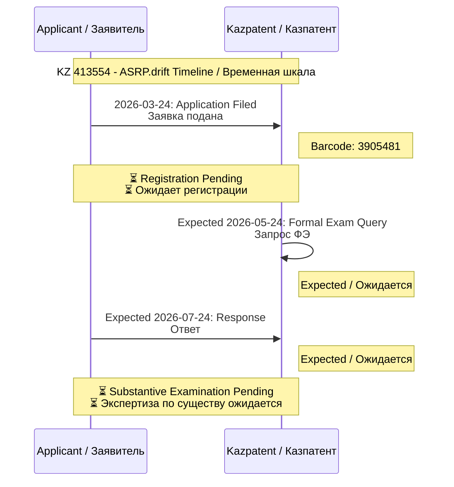

# 🧠 ASRP.drift / ПНИР.дрифт

> **English:** Advanced Synchro Resonance Platform for Deep Resonant Integration of Fielded Thought
> **Русский:** Платформа Нейроинтеграционного Изоморфного Резонанса для Резонансной Интегративной Функциональной Транскоммуникации
> **Қазақша:** Платформа Нейроинтеграциялық Изоморфтық Резонанс Динамикалық Резонанстық Ішкі Функционалдық Трансформациясы

**Abbreviation / Сокращение:**
- **EN:** ASRP.drift (Advanced Synchro Resonance Platform)
- **RU:** ПНИР.дрифт (Платформа Нейроинтеграционного Изоморфного Резонанса)
- **KZ:** ПНИИР (Платформа Нейроинтеграциялық Изоморфтық Резонанс)

---

## 📊 Repository Overview / Обзор репозитория

| Metric / Метрика | Value / Значение |
|------------------|-----------------|
| **Application № / № Заявки** | KZ 413554 |
| **Incoming № / Входящий №** | 2026-20523 |
| **Barcode / Штрихкод** | 3905481 |
| **Filing Date / Дата подачи** | 24 March 2026 / 24 марта 2026 |
| **Status / Статус** | 🟡 Registration Pending / Ожидает регистрации |
| **Patent Office / Патентное ведомство** | Kazpatent (NIIS, Ministry of Justice of RK) / Казпатент (НИИС, МЮ РК) |
| **Country / Страна** | Republic of Kazakhstan / Республика Казахстан |
| **Inventors / Изобретатели** | 3 (🇰🇿 KZ, 🇲🇩 MD, 🇩🇪 DE) |
| **IPC Classification / МПК** | A61B 5/00 (Medical Diagnosis / Медицинская Диагностика), G06N 3/00 (Neural Networks / Нейронные Сети) |
| **Language / Язык** | Russian (Official), English (Translation) / Русский (Официальный), Английский (Перевод) |

---

## 🎯 Invention Details / Детали изобретения

### Names / Названия

| Language / Язык | Name / Название |
|-----------------|-----------------|
| **Russian / Русский** | ПЛАТФОРМА НЕЙРОИНТЕГРАЦИОННОГО ИЗОМОРФНОГО РЕЗОНАНСА ДЛЯ РЕЗОНАНСНОЙ ИНТЕГРАТИВНОЙ ФУНКЦИОНАЛЬНОЙ ТРАНСКОМУНИКАЦИИ |
| **Kazakh / Қазақша** | ПЛАТФОРМА НЕЙРОИНТЕГРАЦИЯЛЫҚ ИЗОМОРФТЫҚ РЕЗОНАНС ДИНАМИКАЛЫҚ РЕЗОНАНСТЫҚ ІШКІ ФУНКЦИОНАЛДЫҚ ТРАНСФОРМАЦИЯСЫ |
| **English / Английский** | ADVANCED SYNCHRO RESONANCE PLATFORM FOR DEEP RESONANT INTEGRATION OF FIELDED THOUGHT |
| **Short (RU) / Краткое (РУ)** | ПНИР.дрифт |
| **Short (EN) / Краткое (EN)** | ASRP.drift |

---

## 👥 Applicants & Inventors / Заявители и Изобретатели

**All inventors are equal co-authors / Все изобретатели являются равными соавторами**

| # | Name / ФИО | Country / Страна | BIN-IIN / БИН-ИИН | Email | Role / Роль | Signed / Подписано |
|---|------------|------------------|-------------------|-------|-------------|-------------------|
| 1 | **OVSEANNIKOVA VALERIA ALEXANDROVNA / ОВСЯННИКОВА ВАЛЕРИЯ АЛЕКСАНДРОВНА** | 🇲🇩 MD | 001228050911 | valeriaovseannicova@asrp.tech | Inventor / Изобретатель | ⏳ Pending / Ожидается |
| 2 | **BANCHENKO DENIS YURIEVICH / БАНЧЕНКО ДЕНИС ЮРЬЕВИЧ** | 🇰🇿 KZ | 800622301483 | denisbanchenko@asrp.tech | Applicant, Inventor / Заявитель, Изобретатель | ✅ Signed / Подписано (24.03.2026) |
| 3 | **KAPUSTIN MYKHAILO MYKHALOVICH / КАПУСТИН МИХАЙЛО МИХАЙЛОВИЧ** | 🇩🇪 DE | 000623050976 | mykhailokapustin@asrp.tech | Applicant, Inventor / Заявитель, Изобретатель | ✅ Signed / Подписано (24.03.2026) |

**Corporate Contact / Корпоративный контакт:** info@asrp.tech

### Co-Inventors Contributions / Вклад Соавторов

| # | Name / ФИО | Contribution / Вклад |
|---|------------|---------------------|
| 1 | **OVSEANNIKOVA VALERIA ALEXANDROVNA / ОВСЯННИКОВА ВАЛЕРИЯ АЛЕКСАНДРОВНА** | Biomedical protocols, experimental design, neurophysiological research / Биомедицинские протоколы, экспериментальный дизайн, нейрофизиологические исследования |
| 2 | **BANCHENKO DENIS YURIEVICH / БАНЧЕНКО ДЕНИС ЮРЬЕВИЧ** | System architecture, mnemonic dream synchronization method, neurointegration technology / Архитектура системы, метод мнемонической синхронизации сновидений, технология нейроинтеграции |
| 3 | **KAPUSTIN MYKHAILO MYKHALOVICH / КАПУСТИН МИХАЙЛО МИХАЙЛОВИЧ** | Machine learning algorithms, GFS prediction module, IT infrastructure / Алгоритмы машинного обучения, модуль прогнозирования GFS, ИТ-инфраструктура |

**All three co-inventors contributed equally / Все три соавтора внесли равный вклад.**

---

## 📬 Correspondence Address / Адрес для переписки

| Field / Поле | Value / Значение |
|--------------|------------------|
| **Name / ФИО** | BANCHENKO DENIS YURIEVICH / БАНЧЕНКО ДЕНИС ЮРЬЕВИЧ |
| **Address / Адрес** | Komarova Street 37, Apt 56, Baikonur, Kyzylorda Region, 468320 / Улица Комарова 37, Кв 56, г. Байконур, Кызылординская область, 468320 |
| **Country / Страна** | Republic of Kazakhstan / Республика Казахстан |
| **Phone / Телефон** | +7 705 913 1157 |
| **Email** | denisbanchenko@asrp.tech |
| **Corporate Email / Корпоративная почта** | info@asrp.tech |

---

## 📅 Examination Timeline / Хронология экспертизы

| Stage / Этап | Duration / Длительность | Status / Статус | Date / Дата |
|--------------|------------------------|-----------------|-------------|
| **1. Preparation / Подготовка** | — | ✅ Complete / Завершено | 24.03.2026 |
| **2. Registration / Регистрация** | 5 working days / 5 рабочих дней | 🟡 Pending / Ожидается | Expected / Ожидается 29.03.2026 |
| **3. Formal Examination / Формальная экспертиза** | 2 months / 2 месяца | ⏳ Pending / Ожидается | Expected / Ожидается 24.05.2026 |
| **4. Substantive Examination / Экспертиза по существу** | 18 months / 18 месяцев | ⏳ Pending / Ожидается | Expected / Ожидается 24.11.2027 |
| **5. Examination Complete / Экспертиза завершена** | 3 months / 3 месяца | ⏳ Pending / Ожидается | Expected / Ожидается Q1 2028 |
| **6. Patent Grant / Выдача патента** | 10 working days / 10 рабочих дней | ⏳ Pending / Ожидается | Expected / Ожидается Q1 2028 |

---

## 🔬 Scientific Research Foundation / Научная Исследовательская База

**EN:** This patent is based on extensive scientific research in inter-brain synchronization, BCI systems, and neurointegration technologies.

**RU:** Этот патент основан на обширных научных исследованиях в области межмозговой синхронизации, систем BCI и технологий нейроинтеграции.

### 📚 Key Scientific Papers / Ключевые Научные Статьи

| # | Paper / Статья | Year / Год | Link / Ссылка | Relevance / Отношение |
|---|---------------|-----------|--------------|----------------------|
| 1 | **Banchenko's Mnemonic Dream Synchronization Method** | 2024 | [📄 PDF](docs/2024-03-15_ScientificArticle_Banchenko_Mnemonic_Dream_Synchronization_Method.pdf) | Foundational method / Фундаментальный метод |
| 2 | **Grivtsova Stress Management Method** | 2024 | [📄 PDF](docs/2024-08-25_ScientificArticle_Grivtsova_Stress_Management_Lucid_Dreams.pdf) | Preparation protocols / Протоколы подготовки |
| 3 | **BCI and Neural Interfaces Review** | 2025 | [📄 PDF](docs/2025-10-25_ScientificArticle_BCI_NeuralInterfaces_ASRP_ResearchGroup.pdf) | Hardware foundation / Аппаратная основа |

### 🔬 Inter-Brain Synchronization Research / Исследования Межмозговой Синхронизации

| Category / Категория | Key Studies / Ключевые Исследования | Link / Ссылка |
|---------------------|-----------------------------------|--------------|
| **Core Studies / Основные Исследования** | Nature Scientific Reports (2017), NeuroImage (2017), Brain & Cognition (2022) | [📊 Database](docs/SCIENTIFIC_RESEARCH_DATABASE.md) |
| **Teams & Cooperation / Команды и Сотрудничество** | SCAN (2016), NeuroImage (2019) | [📊 Database](docs/SCIENTIFIC_RESEARCH_DATABASE.md) |
| **Gaming & Collective Behavior / Игры и Коллективное Поведение** | Brain & Cognition (2022) | [📊 Database](docs/SCIENTIFIC_RESEARCH_DATABASE.md) |
| **Meditation & Synchrony / Медитация и Синхрония** | Neuroscience Letters (2023) | [📊 Database](docs/SCIENTIFIC_RESEARCH_DATABASE.md) |
| **Meta-Analyses / Мета-Анализы** | PMC (2022), PubMed (2024) | [📊 Database](docs/SCIENTIFIC_RESEARCH_DATABASE.md) |

**Full Database / Полная База:** [`docs/SCIENTIFIC_RESEARCH_DATABASE.md`](docs/SCIENTIFIC_RESEARCH_DATABASE.md)

---

## 📋 Document Upload Status / Статус загрузки документов

### ✅ Application Documents (Submitted 24.03.2026) / Документы заявки (Поданы 24.03.2026)

| # | Document / Документ | Pages / Страниц | Language / Язык | Status / Статус | Direct Link / Прямая Ссылка |
|---|--------------------|-----------------|-----------------|-----------------|----------------------------|
| 1 | Application Form / Заявление | 4 | RU/KZ / РУ/КЗ | ✅ Filed / Подано | [📄 PDF](https://github.com/denisbanchenko/Kazpatent_Advanced_Synchro_Resonance_Platform_For_Deep_Resonant_Patent/blob/main/docs/applications/2026-03-24_Application_KZ413554_v1_Original_RU.pdf) |
| 2 | Description / Описание | 4 | Russian / Русский | ✅ Filed / Подано | [📄 DOCX](https://github.com/denisbanchenko/Kazpatent_Advanced_Synchro_Resonance_Platform_For_Deep_Resonant_Patent/blob/main/docs/descriptions/2026-03-24_Description_KZ413554_v1_Original_RU.docx) |
| 3 | Claims / Формула | 3 | Russian / Русский | ✅ Filed / Подано | [📄 DOCX](https://github.com/denisbanchenko/Kazpatent_Advanced_Synchro_Resonance_Platform_For_Deep_Resonant_Patent/blob/main/docs/claims/2026-03-24_Claims_KZ413554_v1_Original_RU.docx) |
| 4 | Abstract / Реферат | 1 | Russian / Русский | ✅ Filed / Подано | [📄 DOCX](https://github.com/denisbanchenko/Kazpatent_Advanced_Synchro_Resonance_Platform_For_Deep_Resonant_Patent/blob/main/docs/abstracts/2026-03-24_Abstract_KZ413554_v1_Original_RU.docx) |
| 5 | Drawings / Чертежи | 1 | — / — | ✅ Filed / Подано | [📄 PDF](https://github.com/denisbanchenko/Kazpatent_Advanced_Synchro_Resonance_Platform_For_Deep_Resonant_Patent/blob/main/docs/drawings/2026-03-24_Figure1_KZ413554_v1.pdf) |
| 6 | Filing Fee Receipt / Квитанция пошлины | 1 | — / — | ✅ Paid / Оплачено | [📄 PDF](https://github.com/denisbanchenko/Kazpatent_Advanced_Synchro_Resonance_Platform_For_Deep_Resonant_Patent/blob/main/payment-receipts/2025-11-12_Payment_KZ413554_FilingFee_6096.16KZT_EPAY944861.pdf) |

---

## 📨 Correspondence Flow / Схема переписки

<div align="center">

### Complete Correspondence History / Полная История Переписки

**🔴 IMPORTANT FOR FOREIGN INVESTORS / ВАЖНО ДЛЯ ИНОСТРАННЫХ ИНВЕСТОРОВ:**

*Full English translations of all Kazpatent correspondence will be available in the* [`translations/`](translations/) *folder.*

*Полные английские переводы всей переписки с Казпатентом будут доступны в папке* [`translations/`](translations/).

</div>



---

## 📚 Translations Index / Индекс Переводов

<div align="center">

### 📖 All English Translations Available / Все Английские Переводы

</div>

| Document Type / Тип Документа | Russian Original / Русский Оригинал | English Translation / Английский Перевод |
|------------------------------|---------------------|----------------------|
| **README** | [🇷🇺 RU](README.md) | [🇬🇧 EN](README.md) (Bilingual / Двуязычный) |
| **Document Upload Tracker** | [🇷🇺 RU](DOCUMENT_UPLOAD_TRACKER.md) | [🇬🇧 EN](DOCUMENT_UPLOAD_TRACKER.md) (Bilingual / Двуязычный) |
| **Document Index** | [🇷🇺 RU](docs/DOCUMENT_INDEX_EN_RU.md) | [🇬🇧 EN](docs/DOCUMENT_INDEX_EN_RU.md) (Bilingual / Двуязычный) |
| **Translations Index** | — / — | [🇬🇧 EN](translations/README_TRANSLATIONS.md) |

---

## 🔗 Related Repositories / Связанные репозитории

<div align="center">

### 🧠 ASRP Neurointegration Platform Ecosystem / Экосистема Платформы Нейроинтеграции ASRP

</div>

**EN:** ASRP.drift is the **core neurointegration platform** that unifies multiple specialized applications including Inspira-X and other neurophysiological analysis systems.

**RU:** ASRP.drift — это **основная платформа нейроинтеграции**, которая объединяет множество специализированных приложений, включая Inspira-X и другие системы нейрофизиологического анализа.

```
┌─────────────────────────────────────────────────────────────────┐
│                    ASRP.drift (KZ 413554)                       │
│         Core Neurointegration Platform /                        │
│         Основная Платформа Нейроинтеграции                      │
│                                                                 │
│  ┌──────────────────────┐    ┌──────────────────────┐          │
│  │   Inspira-X          │    │   Other Neuro        │          │
│  │   (KZ 2025/0914.1)   │    │   Applications       │          │
│  │   Respiratory        │    │   (Future)           │          │
│  │   Analysis           │    │                      │          │
│  │   ⊂ DRIFT SYSTEM     │    │   ⊂ DRIFT SYSTEM     │          │
│  └──────────────────────┘    └──────────────────────┘          │
│                                                                 │
│  Foundation: Inter-brain synchronization, BCI,                  │
│  neurofeedback, dream synchronization                           │
└─────────────────────────────────────────────────────────────────┘
```

| Repository / Репозиторий | Application / Заявка | Relationship / Отношение | Status / Статус |
|-------------------------|---------------------|-------------------------|-----------------|
| **🫁 Inspira-X** | KZ 2025/0914.1 | **⊂ PART OF DRIFT SYSTEM** / **⊂ ЧАСТЬ СИСТЕМЫ DRIFT** | [View / Просмотр](https://github.com/denisbanchenko/Kazpatent_Inspira-X_Respiratory_Analysis_Patent) |
| **Fractal HFS** | KZ 2025/1095.1 | Related hyperbolic field technology / Связанная технология гиперболических полей | [View / Просмотр](https://github.com/denisbanchenko/Kazpatent_Fractal_Biomedical_System_Patent) |
| **Biophotonic** | KZ 2025/1097.1 | Related optical neurodiagnostic / Связанная оптическая нейродиагностика | [View / Просмотр](https://github.com/denisbanchenko/Kazpatent_Biophotonic_Neurodiagnostic_System_Patent) |
| **GFS** | KZ 2024/412106.1 | Related forecasting system / Связанная система прогнозирования | [View / Просмотр](https://github.com/denisbanchenko/Kazpatent_Global_Forecasting_System_Patent) |
| **ASRP.art** | KZ 380648 + PCT 412362 | Related neuro-art analysis / Связанный нейро-арт анализ | [View / Просмотр](https://github.com/denisbanchenko/Kazpatent_Axionetic_Sensing_Reactions_Platform_in_Art_Patent) |

<div align="center">

### 📚 Scientific Research Repositories / Научные Исследовательские Репозитории

</div>

| Repository / Репозиторий | Purpose / Назначение | Link / Ссылка |
|-------------------------|---------------------|---------------|
| **Hyperbolic Field Blood Plasma Study** | Blood plasma coagulation research / Исследование свёртываемости плазмы | [View / Просмотр](https://github.com/AdvancedScientificResearchProjects/Hyperbolic_Field_BloodPlasma_Study) |
| **Hyperbolic Field DAAT Crystal Study** | Human-crystal interaction research / Исследование взаимодействия человек-кристалл | [View / Просмотр](https://github.com/AdvancedScientificResearchProjects/Hyperbolic_Field_DAAT_Crystal_Study) |
| **Hyperbolic Field Agricultural Study** | Plant & fungi growth research / Исследование роста растений и грибов | [View / Просмотр](https://github.com/AdvancedScientificResearchProjects/Hyperbolic_Field_Agricultural_Study) |
| **Hyperbolic Field Emitter Programs** | Emitter control software / ПО управления излучателями | [View / Просмотр](https://github.com/AdvancedScientificResearchProjects/Hyperbolic_Field_Emitter_Programs) |

---

## 💰 Payment Summary / Сводка по платежам

| # | Date / Дата | Payment Type / Тип Платежа | Amount / Сумма | Status / Статус | Direct Link / Прямая Ссылка |
|---|-------------|---------------------------|----------------|-----------------|----------------------------|
| 1 | 12.11.2025 | Filing Fee / Пошлина за Подачу | 6,096.16 KZT | ✅ Paid / Оплачено | [📄 PDF](https://github.com/denisbanchenko/Kazpatent_Advanced_Synchro_Resonance_Platform_For_Deep_Resonant_Patent/blob/main/payment-receipts/2025-11-12_Payment_KZ413554_FilingFee_6096.16KZT_EPAY944861.pdf) |
| **TOTAL / ВСЕГО** | — | **Total Paid / Всего Оплачено** | **6,096.16 KZT** | ✅ **Complete / Завершено** | — |

---

<div align="center">

**Last Updated / Последнее обновление:** 25 March 2026  
**Repository / Репозиторий:** `Kazpatent_Advanced_Synchro_Resonance_Platform_For_Deep_Resonant_Patent`  
**Standard / Стандарт:** UNIFIED_STRUCTURE_STANDARD.md v4.2  
**Status / Статус:** 🟡 Registration Pending / Ожидает регистрации

</div>
