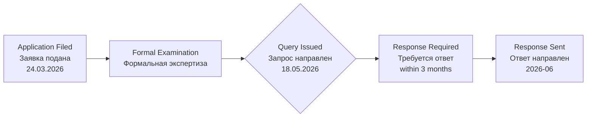

# FORMAL EXAMINATION QUERY — FOREIGN APPLICANT / ЗАПРОС (ИНОСТРАННЫЙ ЗАЯВИТЕЛЬ)

**Kazpatent Official Document / Официальный Документ Казпатент**

---

## DOCUMENT INFORMATION / ИНФОРМАЦИЯ О ДОКУМЕНТЕ

| Field / Поле | Value / Значение |
|-------------|-----------------|
| **Document Type / Тип Документа** | Formal Examination Query — Foreign Applicant / Запрос этапа формальной экспертизы — иностранный заявитель / патентный поверенный |
| **Application Number / Номер Заявки** | KZ 2026/0347.1 |
| **Barcode / Штрихкод** | 3976212 |
| **Date / Дата** | 18 May 2026 / 18 мая 2026 |
| **Direction / Направление** | Incoming / Входящий |
| **From / От** | Kazpatent (NIIS — National Institute of Intellectual Property, Ministry of Justice of RK) |
| **To / Кому** | Banchenko Denis Yurievich / Банченко Денис Юрьевич |
| **Invention Title / Название Изобретения** | Platform for Neuro-Integration Isomorphic Resonance for Resonant Integrative Functional Transcommunication / Платформа нейроинтеграционного изоморфного резонанса для резонансной интегративной функциональной транскоммуникации |

---

## EXAMINATION STATUS / СТАТУС ЭКСПЕРТИЗЫ

---

## RUSSIAN ORIGINAL / РУССКИЙ ОРИГИНАЛ

**Исходящий орган:** Республиканское государственное предприятие на праве хозяйственного ведения «Национальный институт интеллектуальной собственности» Комитета по правам интеллектуальной собственности Министерства юстиции Республики Казахстан

**Адрес:** Проспект Мангилик Ел, здание 57А, н.п. 8, район Есиль, город Астана, Республика Казахстан, 010000. Тел: (7172) 62 15 15. https://qazpatent.kz/ru, e-mail: qazpatent@qazpatent.kz

**Адресат:** Банченко Денис Юрьевич, ул. Комарова 37, кв. 56, г. Байконур, Кызылординская область, 468320; denisbanchenko@asrp.tech

**При переписке просим ссылаться на заявку № 2026/0347.1 от 24.03.2026**

---

### ЗАПРОС

**(54) по заявке на изобретение «Платформа нейроинтеграционного изоморфного резонанса для резонансной интегративной функциональной транскоммуникации»**

В представленном Заявлении о выдаче патента Республики Казахстан на изобретение кроме гражданина Республики Казахстан Банченко Дениса Юрьевича в качестве заявителя также указано иностранное физическое лицо — КАПУСТИН МИХАЙЛО МИХАЙЛОВИЧ (Федеративная Республика Германия).

Согласно пункту 5 статьи 36 Патентного Закона Республики Казахстан от 16 июля 1999 года № 427-I (с изменениями и дополнениями по состоянию на 25.01.2026 г.) (далее — Закон), физические лица, проживающие за пределами Республики Казахстан, или иностранные юридические лица осуществляют свои права заявителя, патентообладателя, а также права заинтересованного лица в уполномоченном органе и его организациях через патентных поверенных.

Пунктом 1 статьи 38 Закона установлено, что иностранные физические и юридические лица пользуются правами, предусмотренными Законом, наравне с физическими и юридическими лицами Республики Казахстан в силу международных договоров, участником которых является Республика Казахстан или на основе принципа взаимности.

В настоящее время между Федеративной Республикой Германия и Республикой Казахстан отсутствует двустороннее соглашение, предоставляющее национальным заявителям одного государства право на основе принципа взаимности вести дела непосредственно с патентным ведомством другого государства.

В этой связи, на основании пункта 5 статьи 36 Закона сообщаем о необходимости назначения представителя заявителя — патентного поверенного Республики Казахстан для реализации своих прав на получение патента на изобретение. Полномочия патентного поверенного удостоверяются доверенностью.

Учитывая вышеизложенное, просим в течение трех месяцев с даты направления запроса представить ответ на запрос экспертизы. После представления ответа рассмотрение заявки будет продолжено.

При непредставлении в указанный срок ответа на запрос либо ходатайства о продлении установленного срока, в соответствии с пунктом 3 статьи 22 Закона РК, заявка считается отозванной.

**Подписано ЭЦП:**
Д. Алимжанова (Руководитель управления)
О. Жұбанов (Заместитель руководителя управления)

---

## ENGLISH TRANSLATION / АНГЛИЙСКИЙ ПЕРЕВОД

**Issuing body:** Republican State Enterprise on the right of economic management "National Institute of Intellectual Property" of the Committee on Intellectual Property Rights of the Ministry of Justice of the Republic of Kazakhstan

**Address:** Mangilik El Avenue, Building 57A, premises 8, Yesil district, Astana, Republic of Kazakhstan, 010000. Tel: (7172) 62 15 15. https://qazpatent.kz/ru, e-mail: qazpatent@qazpatent.kz

**Addressee:** Banchenko Denis Yurievich, 37 Komarov St., apt. 56, Baikonur, Kyzylorda region, 468320; denisbanchenko@asrp.tech

**Please reference Application No. 2026/0347.1 dated 24.03.2026 in all correspondence.**

---

### QUERY

**(54) Regarding the patent application for "Platform for Neuro-Integration Isomorphic Resonance for Resonant Integrative Functional Transcommunication"**

The Patent Application for a patent of the Republic of Kazakhstan for an invention, in addition to the citizen of the Republic of Kazakhstan Banchenko Denis Yurievich, also designates a foreign individual as applicant — KAPUSTIN MYKHAILO MYKHAILOVYCH (Federal Republic of Germany).

Pursuant to Article 36, paragraph 5 of the Patent Law of the Republic of Kazakhstan dated 16 July 1999, No. 427-I (as amended and supplemented as of 25.01.2026) (hereinafter — the Law), individuals residing outside the Republic of Kazakhstan, or foreign legal entities, exercise their rights as applicants, patent holders, and interested parties before the authorized body and its organizations through patent attorneys.

Article 38, paragraph 1 of the Law establishes that foreign individuals and legal entities enjoy the rights provided by the Law on equal terms with individuals and legal entities of the Republic of Kazakhstan, by virtue of international treaties to which the Republic of Kazakhstan is a party, or on the basis of the principle of reciprocity.

At present, there is no bilateral agreement between the Federal Republic of Germany and the Republic of Kazakhstan granting nationals of one state the right, on the basis of the principle of reciprocity, to conduct business directly with the patent office of the other state.

In this regard, pursuant to Article 36, paragraph 5 of the Law, we hereby inform you of the necessity to appoint a representative of the applicant — a patent attorney of the Republic of Kazakhstan — in order to exercise the applicant's rights to obtain a patent for the invention. The authority of the patent attorney is confirmed by a power of attorney.

In view of the foregoing, we request that a response to this examination query be submitted within three months from the date of dispatch of this query. Following submission of the response, examination of the application will continue.

Should the response to the query, or a petition for extension of the established deadline, not be submitted within the specified period, the application shall be deemed withdrawn in accordance with Article 22, paragraph 3 of the Law of the Republic of Kazakhstan.

**Signed with EDS (Electronic Digital Signature):**
D. Alimzhanova (Head of Department)
O. Zhubanov (Deputy Head of Department)

---

## LEGAL REFERENCES / ПРАВОВЫЕ ССЫЛКИ

| Article / Статья | Subject / Предмет |
|-----------------|-------------------|
| Art. 36(5) Patent Law No. 427-I / Ст. 36(5) ПЗ № 427-I | Foreign persons act through patent attorneys / Иностранные лица действуют через патентных поверенных |
| Art. 38(1) Patent Law No. 427-I / Ст. 38(1) ПЗ № 427-I | Rights of foreign persons on reciprocity basis / Права иностранных лиц на основе взаимности |
| Art. 22(3) Patent Law No. 427-I / Ст. 22(3) ПЗ № 427-I | Application deemed withdrawn if no timely response / Заявка считается отозванной при отсутствии ответа |

---

## RESPONSE DEADLINE / СРОК ОТВЕТА

**Deadline / Срок:** 3 months from 18 May 2026 = **18 August 2026**

**Required action / Требуемое действие:** Appoint a registered patent attorney of the Republic of Kazakhstan to represent the foreign co-applicant (Kapustin Mykhailo, Germany) and submit confirmation (power of attorney) to Kazpatent within the deadline.

---

## RELATED DOCUMENTS / СВЯЗАННЫЕ ДОКУМЕНТЫ

| # | Document / Документ | Date / Дата |
|---|---------------------|-------------|
| 1 | Patent Application Filed / Заявка подана | 24.03.2026 |
| 2 | Foreign Applicant Query / Запрос (иностранный заявитель) | 18.05.2026 |
| 3 | Response (power of attorney + patent attorney appointment) / Ответ | — |

---

*Bilingual (EN/RU) translation of the original Kazpatent document. For legal purposes, refer to the original Russian text. / Двуязычный (EN/RU) перевод оригинального документа Казпатента. В правовых целях следует обращаться к оригинальному русскому тексту.*
